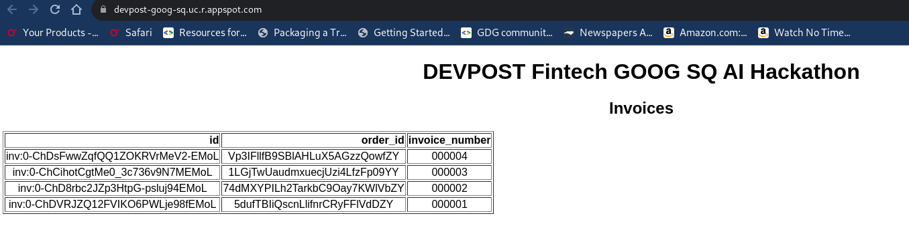
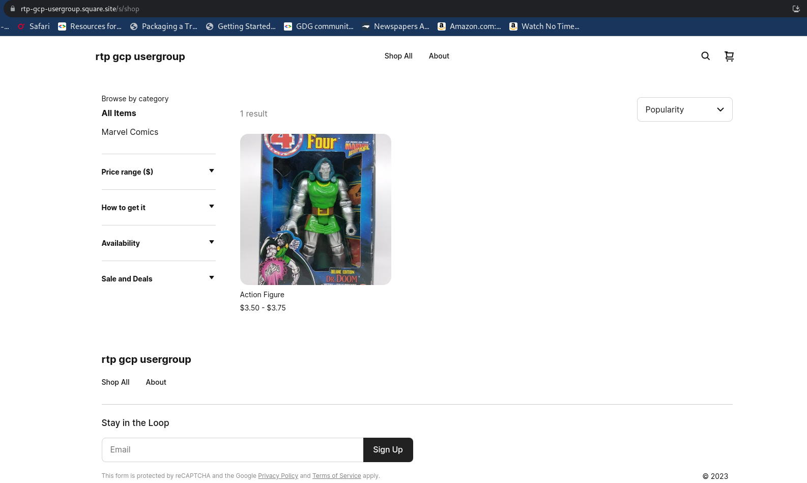
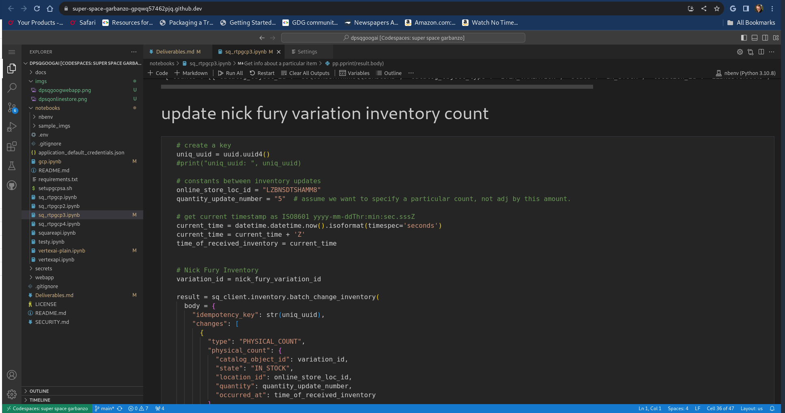

# Hackathon Deliverables

# General Info

## Project Name
RTP-GCP Project SAJ

## Elevator pitch
A comphrensive demo of Squareup, VertexAI and Google Cloud Platform App Engine.  It demos how to create automated item listings for the Square Sellers and a webapp to list current invoices.  It currently does not do much regarding the webapp, but it could be expanded upon later.  Perhaps its not an impressive app, but it gives working examples of how to use the various components.

# Project Details

## Project Story

### About the project

#### Inspiration

The RTP-GCP usergroup located in Durham, North Carolina, USA meets each weekend to work together to learn how to use Google Cloud Platform.  We were excited to join this hackathon since DEVPOST hackathons are a great way to focus on learning a technology.  Considering we knew nothing about the squareup API, this also seemed like a great oppurtunity to expand and apply our knowledge!

#### What it does

This combination of Jupyter Notebooks and App Engine webapp demonstrates how to use SQ and GOOG APIs to automate an online store front.  It does this by updating a SQ storefront with items for sale using AI generated product descriptions.  

#### How we built it

The hackathon entry was built in series of steps:

###### Step 1

Requirements Analysis

Read the project rules and examine the project awards to determine the set of primary characteristics the submission should contain.  The following table was generated with the following columns:

* Requirement Description
  * A capability our Minimal Viable Product (MVP) should fullfill
* Source
  * Where this requirement was found or dervied from more explicit requirements
* Notes
  * additional info regarding the requirement

| Requirement  Description                      |  Source                      |   Notes      | COMPLETE            
| ------------------------------------------| ---------------------- | ------------------- | -----------------
| Create an APP                                         | Project Rules             | App integrates to SQ app store | TODO
| New or updated                                      | Project Rules             | No prior knowledge so easy yes | [x]
| Image/Audio                                           | Project Rules              | Use API to upload image | [x]
| online experience                                   | Project Rules             | Simplify product listing | [x] automated
| online experience                                   | Project Rules             | Simplify invoice generation | TODO
| One SQ API                                             |                                     |     |                          
|  [ ] Terminal   option                                |  Project Rules            |  not selected |                              
|  [ ] Subscriptions  option                        |  Project Rules            |   not selected |                             
|  [x] Invoices   option                                |  Project Rules            |  Requires inventory item? | [x]    
| One GOOG Foundation Model API      |                         |                                     |          |                      
| [x] Text   option                                        |  Project Rules            |  Use Vertex AI  API to generate text | [x]                 
| [ ] Chat  option                                         |  Project Rules            |   not selected                 | 
| GOOG Payments API                             |  Project Judges         |    Learn API - Not necessary its avaliable already | [x]                           
| Idea                                                           |       If we can't make something elaborate at least make it work    | [x]                                
| Quality                                                      | Judges & Criteria      |  #2 goal make it work well         | [x]                    
| Implementation                                       | Judges & Criteria      |  #1 goal can we make it work                               
| Potential Value                                         | Judges & Criteria      |     If we can't make something elaborate at least make it work and a good basis for further development | [x]                                      
| Integrative Experience                           |  Judges & Criteria      |   Make something that allows quick integration. Create notebooks for prototyping and a webapp all in the same programming language and use similar mechanism for API key security | [x]                             
| Potential Impact                                      | Judges & Criteria      |   Although the Square Dashboard is very well designed and already has hooks for Images based upon item text, create a web app that allows users to have fewer controls for a steamlined workflow.  Pick an image, write some text, determine pricing, use AI to enhance text, automate emails for purchases sending AI generated text. ie. Thanks John Smith for buying item XXX, we hope you enjoy item XXX,YYY and yadda yadda. | [ ]
| Inventory API                                           | Derived Requirment  |   We need to learn this in order to do items and invoice | [x]
| Automate Listing                                     | Derived Requirment  |    ditto | [x] prototype  [ ] webapp
| Automate Invoice                                    | Derived Requirment  |    | [x] prototype  [x] webapp
| GCP Webapp - Use AppEngine            | Derived Requirement |  Implement in python so all APIs are consistent across notebooks and app, ease of use for integration in samples | [x] 


###### Step 2

As a group we identifid the following knowledge gaps:

* Square online stores
  - zero experience
* Squareup API
  - zero experience
* GenAI
  - only a little
* Vertex AI API
  - only a little
* GCP App Engine
  - some experience but none hosting python. Prior experience was with Javascript NodeJS
  - Flask 
    - zero experience


We started learning the squareup APIs and vertex APIs using jupyter notebooks hosted in github codespaces.  We used our current open source project for doing NodeJS apps and GenAI learning to host the development.  This is hosted [here](https://github.com/rtp-gcp/gcp_icy_bridge/tree/master/genai/devpost).


###### Step 3

We migrated to a GCP python/flask based webapp.

###### Step 4

We migrated to a new github repo soley focused on this hackathon to make a devpost submission.  This is [here](https://github.com/rtp-gcp/dpsqgoogai).


###### Step 5

Wrapping up project deliverables. 


#### Challenges we ran into

* All of us are new to GenAI/LLM but we have some knowledge
* All of us are completely new to SQ online stores and their API.  Zero knowledge
* All of us are on a budget.  API usage costs money and time.  Try to use cheap methods
* Some of us have limited knowledge of GCP, none really in terms of Python web apps
* Contest requirements created long list of unknowns in terms of SQ squareup API
  - Invoice API requires use of Inventory API
  - Inventory API is a derived requirement
  - Image manipulation requires use of Inventory API
  - Inventory API requires Category API
  - Category API requires Upsert and Variation knowledge
  - While it makes sense, it does not come easily
  
* SQ Inventory Image API is documented wrong.  Docs and code are not in sync
    - See github issue [here](https://github.com/square/square-python-sdk/issues/121)
    - This was resolved but took time
* SQ API in general are tedious
  - Once we figured out how to use upsert I had to ask about modifying categories.  It turns out
when you upsert an item, all items must be reupdated otherwise they are erased.  ie. if you upload a portion of an item, attempt to upsert modifications to new characteristics, any missing characteristics are erased.  This means no partial updates in a series of small changes.  This was unexpected.
   - No ability to migrate items from in the library to visible in the online store.  Once again, spent considerable time trying to get this to work and finally found this out in the SQ discord chat.  The api should mention limitations to what can not be done.  Especially when visiblity is listed in the online UI and in the API.
   - Spent time trying to modify invoices but it turns out that this is not possible after the fact.  Found an answer via the discord after we spent a few hours attempting otherwise.
   


#### Accomplishments that we're proud of

* We have an MVP which meets requirements and works.  
* Its well documented and the code is public.
* We started with nothing and worked together to have something worthy of a submission.
* We `#builtinpublic` and made a good `#opensource` example of how to use both company's APIs.
* Nothing makes friends like working together on a shared endeavor.


#### What we learned

We learned about:
* how to use GOOG Vertex AI in a notebook not hosted in AI Workbench or Collab
* SQ has an online store capabiity
* SQ has an API to manipulate the store
* GCP App Engine Python Flask web app
* keep our Python chops up to date

#### What's next for SAJ

If we win funding we will use the money towards updating the app and putting in SQ marketplace.  It would be great to have the webapp provide the ablity to upload images and generate text like the notebooks. I imagine we would use a login capability, an upload for images to cloud storage and edit box for text.  Mods to extract emails from invoices to send custom emails to customers. 


## Built with

* Python
* genAI
* Square
* Google-cloud
* Flask

## Project Media





## Video demo link

TODO: Add youtube link of demo

# Additional Info

## App Status

"Appears in project gallery"?

No.  There is a webapp, but we haven't looked into publishing to Square App Gallery yet.

## Testing instructions for application

See docs in github for how to setup notebooks and GCP.  .env file looks this:


```# This is for square and vertexai
GOOGLE_APPLICATION_CREDENTIALS=application_default_credentials.json
GCP_PROJ_ID=


# square sandbox
#SQUARE_ACCESS_TOKEN=
#SQUARE_APP_ID=
#SQUARE_LOCATION_ID=

# Production
SQUARE_ACCESS_TOKEN=
SQUARE_APP_ID=
SQUARE_LOCATION_ID=
```


## Provide access to working application (test account, website, sandbox / production)

* [online store](https://rtp-gcp-usergroup.square.site/)
* [production webapp](https://devpost-goog-sq.uc.r.appspot.com/)
* [SQ Items prototype production notebook](https://github.com/rtp-gcp/dpsqgoogai/blob/main/notebooks/sq_rtpgcp3.ipynb)
* [SQ Invoices prototype production notebook](https://github.com/rtp-gcp/dpsqgoogai/blob/main/notebooks/sq_rtpgcp4.ipynb)
* [Vertex AI prototype production notebook](https://github.com/rtp-gcp/dpsqgoogai/blob/main/notebooks/gcp.ipynb)
